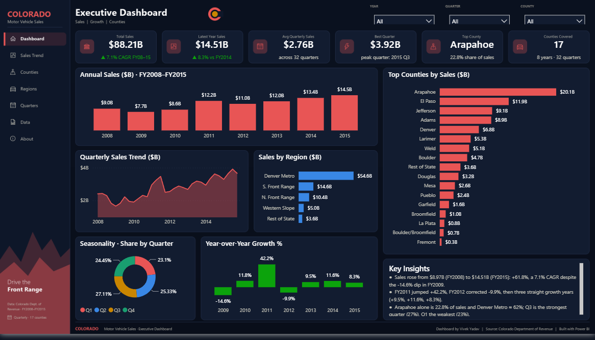
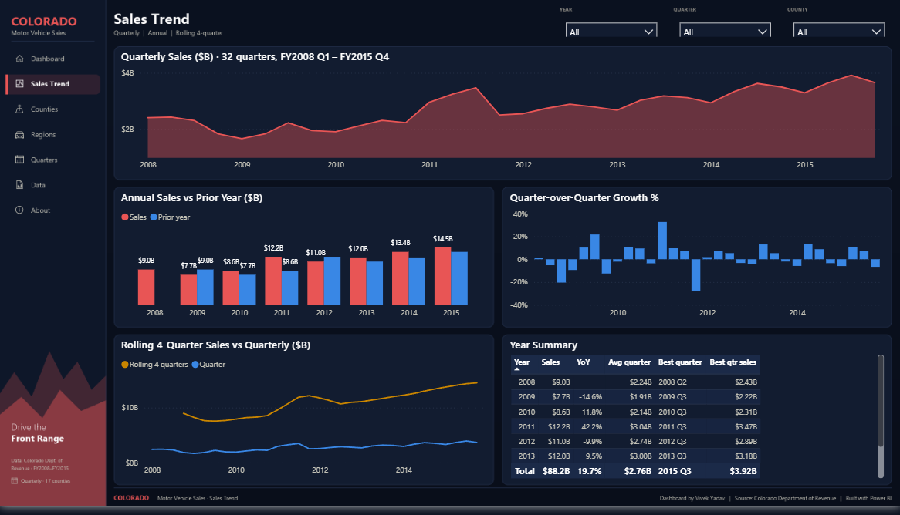
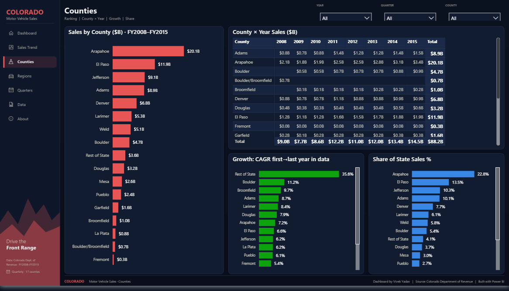
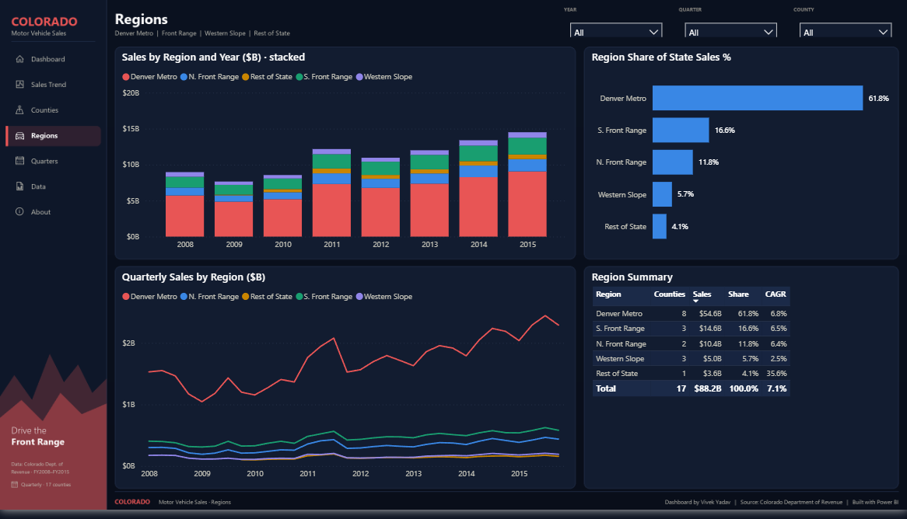
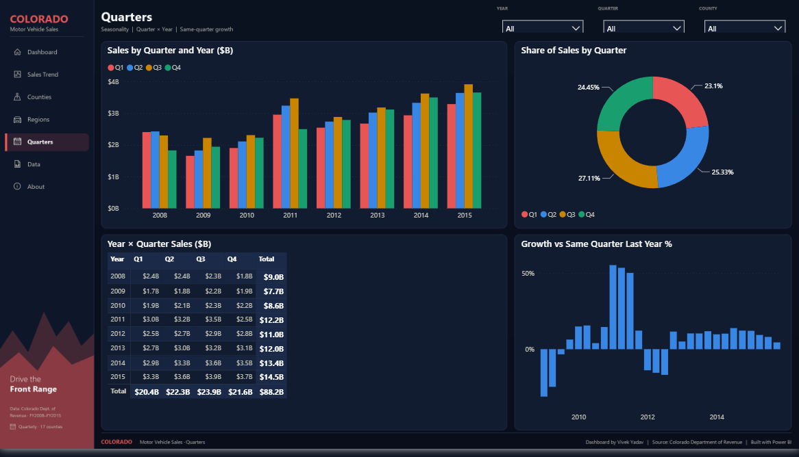
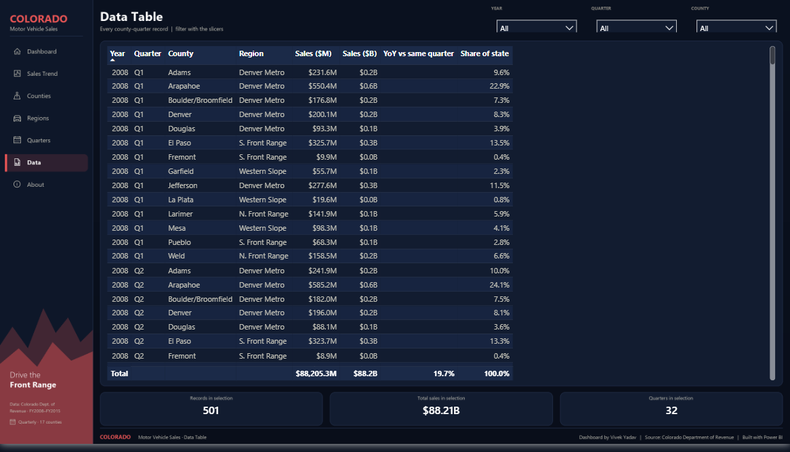
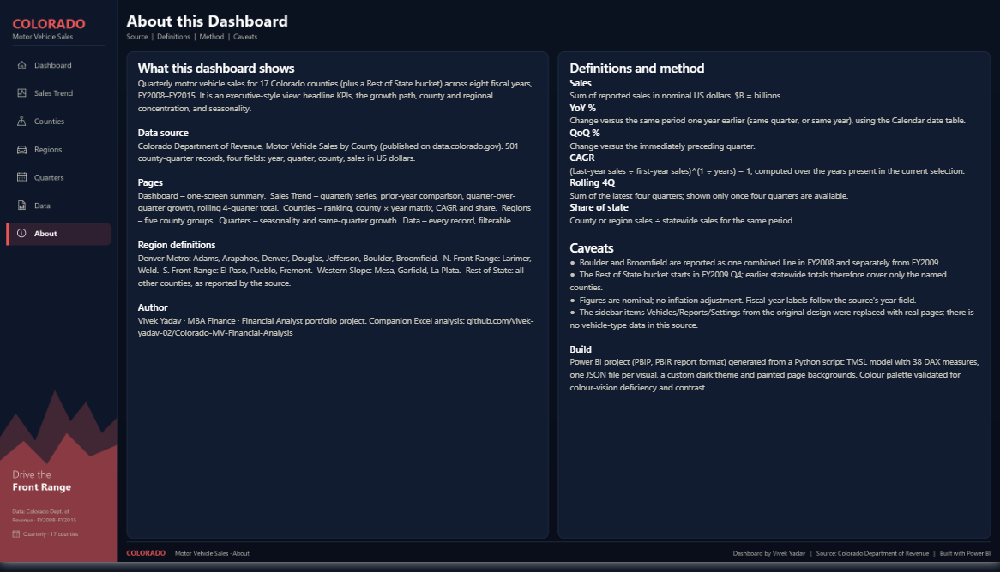

# Colorado Motor Vehicle Sales — Power BI Executive Dashboard (FY 2008–FY 2015)

A seven-page, app-style **Power BI** report on quarterly motor vehicle sales across 17 Colorado
counties, FY 2008–FY 2015, plus the written financial analysis report. Built as a Power BI Project
(PBIP) so every measure, visual and page is version-controlled as text.

## Repository contents

| Path | Description |
|---|---|
| `Colorado_MV_Sales.pbip` | Power BI project entry point — open this in Power BI Desktop |
| `Colorado_MV_Sales.SemanticModel/` | Data model (TMSL): Sales + Calendar tables, 38 DAX measures, `DataFolder` parameter |
| `Colorado_MV_Sales.Report/` | Report definition (PBIR): 7 pages, 109 visuals, dark theme, painted page backgrounds |
| `data/colorado_motor_vehicle_sales.csv` | Source data — 501 county-quarter records (year, quarter, county, sales) |
| `screenshots/` | One PNG per report page |
| `scripts/build_pbip.py` | Python generator that produces the entire project from the CSV |
| `COLORADO MOTOR VEHICLE SALES Financial Analysis Report _ FY 2008 – FY 2015.pdf` | Written report: methodology, annual performance, trends, findings |

## Report pages

The left sidebar is real navigation: every item is a page-navigation button (Ctrl+click in
Desktop, plain click in the Power BI Service).

| Page | What it answers |
|---|---|
| **Dashboard** | One-screen summary: six KPI tiles, annual sales, county leaderboard, quarterly trend, region split, seasonality, YoY growth, key insights |
| **Sales Trend** | 32-quarter series, annual sales vs prior year, quarter-over-quarter growth, rolling 4-quarter total, year summary table |
| **Counties** | County ranking, county × year matrix, CAGR by county, share of state |
| **Regions** | Five county groups: stacked sales by year, share of state, quarterly trend by region, region summary |
| **Quarters** | Seasonality: sales by quarter and year, quarter share, year × quarter matrix, growth vs the same quarter last year |
| **Data** | Every county-quarter record with $M, $B, YoY and share columns, plus record/total/quarter counts for the selection |
| **About** | Source, page guide, region definitions, measure definitions, caveats, build notes |

Slicers for Fiscal Year, Quarter and County sit in the header of every analysis page. KPI
sub-labels (CAGR, YoY vs prior year, peak quarter, top-county share) recalculate for the selection.

Page screenshots

| | |
|---|---|
|  |  |
|  |  |
|  |  |

## Headline findings

- Sales rose from **$8.97B (FY 2008) to $14.51B (FY 2015)**: +61.8%, a **7.1% CAGR**, despite a -14.6% dip in FY 2009.
- FY 2011 jumped +42.2%, FY 2012 corrected -9.9%, then three straight growth years (+9.5%, +11.6%, +8.3%).
- **Arapahoe County** alone is $20.1B (22.8% of sales); the top four counties are over half the market.
- **Denver Metro ≈ 62%** of statewide sales, S. Front Range ≈ 17%, N. Front Range ≈ 12%, Western Slope ≈ 6%.
- **Q3 is the strongest quarter** (27% of annual sales); Q1 the weakest (23%).

## How to open

1. Install [Power BI Desktop](https://www.microsoft.com/power-platform/products/power-bi/desktop) (2.157 / Aug 2026 or later).
2. Clone the repository and open `Colorado_MV_Sales.pbip`.
3. Point the `DataFolder` parameter at your local `data\` folder
   (Transform data → Manage parameters), then click **Refresh**.
4. Save once; Desktop keeps a local cache so later opens are instant.

## Model

- **Sales** (CSV via Power Query): Year, Quarter, County, Sales, plus derived `Date` (quarter start),
  `Period` ("2011 Q3") and `Region` (Denver Metro / N. Front Range / S. Front Range / Western Slope / Rest of State).
- **Calendar**: daily date table 2008–2015 marked as the date table; `Quarter Start` drives every
  time-series axis so `SAMEPERIODLASTYEAR`, `DATEADD` and `DATESINPERIOD` work.
- Measures include `Total Sales`, `Sales $B/$M`, `Sales PY`, `YoY %`, `QoQ %`, `Rolling 4Q Sales`, `CAGR`,
  `Latest Year Sales`, `Avg Quarterly Sales`, `Best Quarter`, `Top County`, `Share of State %`, plus
  text measures for KPI sub-labels and colour measures for conditional bar colours.

## Design notes

- Executive app layout: fixed left navigation, KPI strip, hero chart, leaderboard, insights panel, the same chrome on every page.
- Dark theme with one accent (`#E85555`); categorical palette `#E85555 #3987E5 #C98500 #199E70 #9085E9`
  passes colour-vision-deficiency and contrast checks on the `#121C30` panel surface.
- No dual-axis charts; growth always gets its own panel.
- Visual backgrounds are transparent; cards, icons and navigation are painted into one background
  PNG per page, generated by the build script.

## Data caveats

- `Boulder/Broomfield` is reported combined for FY 2008 only; from FY 2009 the two counties are separate.
- `Rest of State` exists from FY 2009 Q4, so earlier statewide totals cover only the named counties.
- Sales are nominal USD; no inflation adjustment. There is no vehicle-type field in the source.

## Tools

- **Power BI Desktop** — PBIP / PBIR project format, DAX, Power Query (M)
- **Python** (Pillow) — project generator and page-background renderer
- Source: Colorado Department of Revenue, Motor Vehicle Sales by County (data.colorado.gov)

> The original Excel dashboard that this Power BI report replaces is preserved in the
> repository's git history (commits up to September 2026).

## Author

**Vivek Yadav** — [GitHub Profile](https://github.com/vivek-yadav-02)
